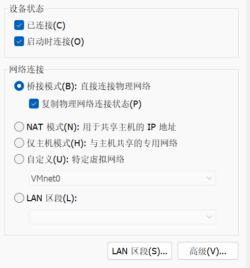
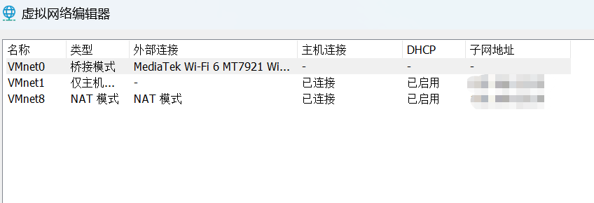

在多次尝试登录时使用了多个不同的密码或密钥，服务器可能会认为这是一次暴力攻击，从而阻止进一步的尝试。

以下是一些解决方法：

1. **等待一段时间：** 等待一段时间，然后再尝试连接。有时服务器会在一段时间内暂时阻止访问。

2. **确保使用正确的身份验证信息：**

   - 如果使用密码进行身份验证，确保输入的密码是正确的。
   - 如果使用SSH密钥对，确保私钥与目标主机上关联的公钥匹配。

3. **检查SSH密钥：** 如果使用SSH密钥对进行身份验证，确保SSH密钥配置正确，并且没有多个不同的密钥尝试进行身份验证。

4. **禁用多个身份验证方法：** 可以通过在SSH连接时使用 `-o` 选项禁用多个身份验证方法，例如：

   ```
   ssh -o PubkeyAuthentication=no -o PasswordAuthentication=yes username@ip address
   ```
   
这将禁用公钥身份验证，仅使用密码进行身份验证。请替换 `username` 和 `ip address` 为实际的用户名和IP地址。


### 关于只能在某个特定的网络下才能进行ssh连接虚拟机的问题解决

在使用wsl—ubuntu连接虚拟机上的redhat时

`ssh username@ip address`

好长时间不响应，最终会显示连接失败

一开始用的是学校的网络，在我切换成自己的个人热点去进行ssh连接的时候却能够成功，我又用了朋友的热点，然后就失败了。

后来在网络和Internet设置里看到每个网络都有特定的IPv4地址，虚拟机的ip是在其子网下的，我当时的虚拟机没有使用自动分配ip地址

虚拟机中的redhat操作'VPN连接-配置VPN-有线'方法改为自动（DHCP）就可以了，之前是手动的，只设置了我当时热点的地址，所以说只能在那个网络下连接。



修改好之后，回到虚拟机终端

`ifconfig`

即可看到当下的inet address：ip address

`ssh root@ip address` 

输入密码即可连接

我的虚拟机设置是这样的





要检查目标主机上的 SSH 服务，可以执行以下步骤：

### 对于 Linux 系统：

1. **检查 SSH 服务是否运行：** 在目标主机的终端中执行以下命令，检查 SSH 服务是否正在运行：

    ```bash
    systemctl status ssh
    ```

    如果服务正在运行，你应该看到服务状态信息。如果未运行，你可以使用以下命令启动 SSH 服务：

    ```bash
    sudo systemctl start ssh
    ```

2. **确认 SSH 服务启动时自启动：** 为了确保 SSH 服务在系统启动时自动启动，可以执行以下命令：

    ```bash
    sudo systemctl enable ssh
    ```

### 对于 Windows 系统：

1. **检查 SSH 服务状态：** 在 Windows 上，可以通过服务管理器检查服务状态。按下 `Win + R` 打开运行窗口，输入 `services.msc`，查找并确认 "OpenSSH SSH Server" 服务的状态。

2. **确认 SSH 服务已安装：** 请确保在 Windows 上安装了 OpenSSH 服务器功能。在 "控制面板" -> "程序" -> "程序和功能" -> "启用或关闭 Windows 功能" 中，确认 "OpenSSH 服务器" 被选中。

### 检查配置：

无论是在 Linux 还是 Windows 上，SSH 服务的配置文件通常位于 `/etc/ssh/sshd_config`（Linux）或 `C:\ProgramData\ssh\sshd_config`（Windows）。可以打开配置文件查看相关配置项，确保 SSH 服务设置正确。例如，检查监听的地址、端口、是否允许密码登录等。

```bash
# Linux 上查看 SSH 配置
cat /etc/ssh/sshd_config
```

```powershell
# Windows 上查看 SSH 配置
Get-Content C:\ProgramData\ssh\sshd_config
```

### 防火墙设置：

确保防火墙设置允许 SSH 流量通过。如果你使用的是 Linux，可以使用 `ufw`（或其他防火墙管理工具）：

```bash
sudo ufw allow 22
```

在 Windows 上，确保防火墙允许入站 SSH 连接。

### 用户凭据：

确保你使用的用户名和密码或密钥对是正确的。

在检查完这些方面后，应该能够连接到目标主机的 SSH 服务。如果仍然存在问题，查看 SSH 服务的日志文件可能有助于找到具体的错误信息。
